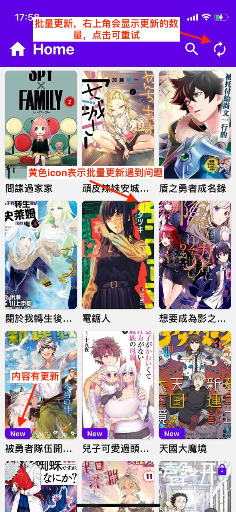
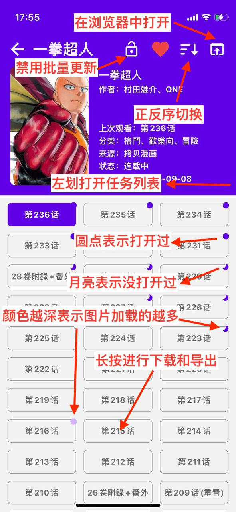
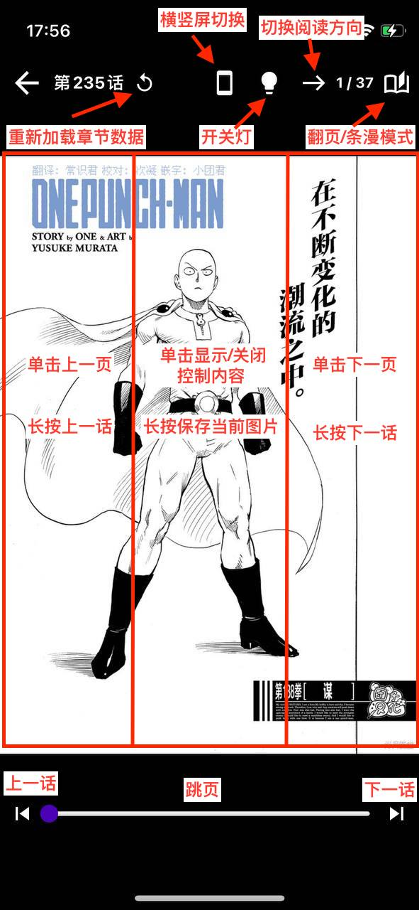
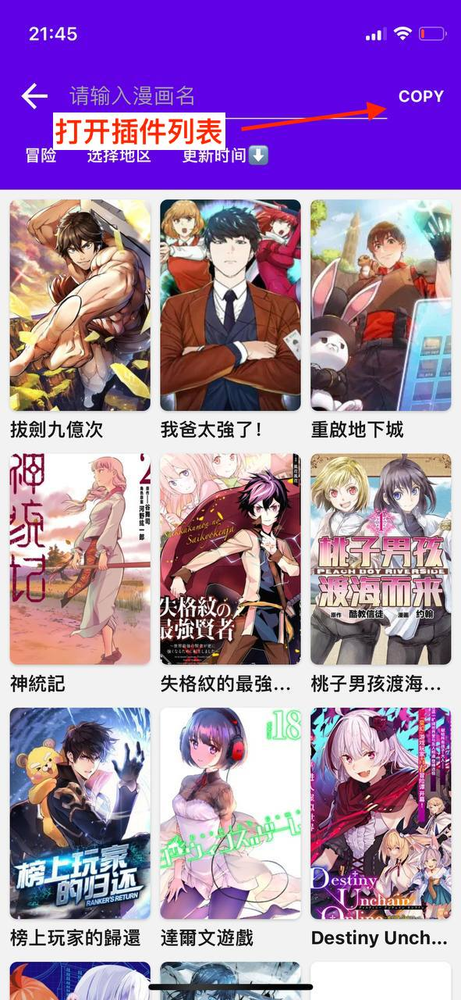
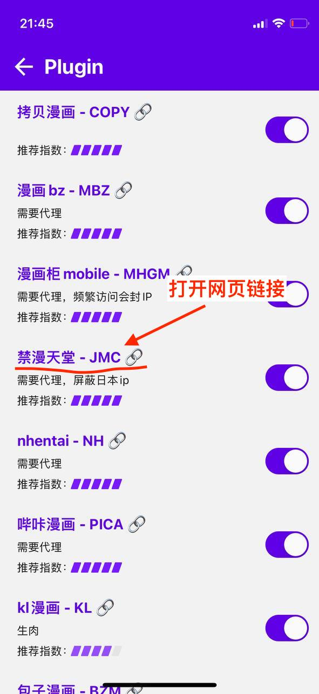
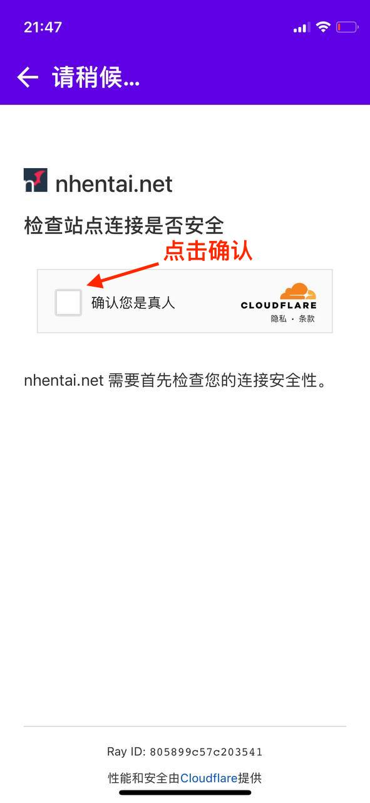
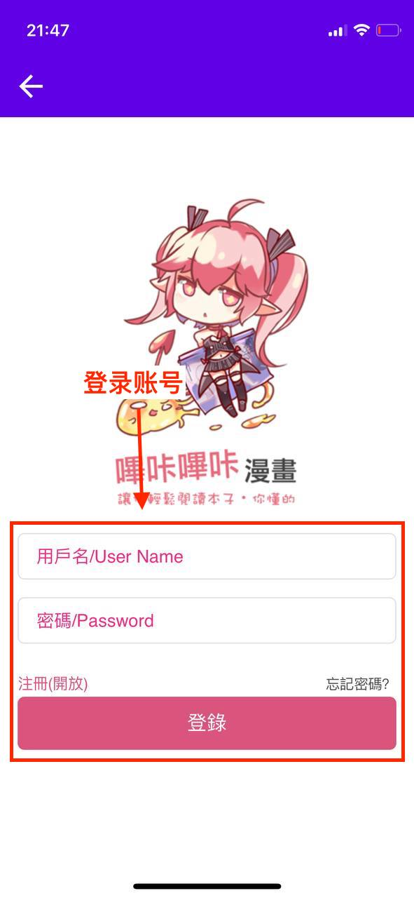

# MangaReader

一个漫画 APP📱，基于 react-native 构建，兼容 Android、Ios，尽可能适配平板

- 插件式设计、近十个可用[插件](#插件)
- 收藏、搜索、批量更新、下载、导出
- 翻页/条漫/平叛双页模式、无限翻页、保存图片
- 数据全本地离线化、支持备份和恢复

  

## 插件

- [x] ~~[漫画柜](https://www.mhgui.com/)（大陆版，访问 403，已失效）~~
- [x] [漫画柜 mobile](https://m.manhuagui.com/)（需要代理）
- [x] [拷贝漫画](https://www.copymanga.org/)
- [x] [漫画 db](https://www.manhuadb.com/)
- [x] [禁漫天堂](https://18comic.vip)（需要代理，日本 ip 无法访问，疑似开启了 cloudflare，如果无法使用，请参考[cf 校验](#cloudflare-校验)）
- [x] [动漫之家 mobile](https://m.dmzj.com/)（现在需要登录才能看了，使用前请在 webview 里登录）
- [x] ~~[漫画猫](https://www.maofly.com/)（网站挂了，已失效）~~
- [x] [kl 漫画](https://klmanga.net/)
- [x] [nhentai](https://nhentai.net/)（需要代理和[cf 校验](#cloudflare-校验)）
- [x] [哔咔漫画](https://manhuabika.com/)（需要代理和[登录](#登录认证相关)）
- [x] [漫画 bz](https://mangabz.com/)（需要代理）
- [x] [包子漫画](https://cn.baozimh.com/)（不需要代理但海外 ip 会走 cloudflare，需要在 webview 里通过校验）

## 使用指南

  
  
  
  
  

## 下载

Android：&emsp;/&emsp;[下载 apk](https://github.com/youniaogu/MangaReader/releases)

Ios：[未签名 ipa](https://github.com/youniaogu/MangaReader/releases)

[使用 Altstore 安装 ipa 文件](https://faq.altstore.io/)

## cloudflare 校验

下面以 nhentai 为例：

nhentai 开启了 cloudflare 的 ddos 保护，在使用此插件前，请遵循下面流程在 webview 里通过 cloudflare 校验并获得 cookies

webview 存在 bug，需要安卓版本 9 及以上

  
  
  
  
  

## 登录认证相关

下面以哔咔漫画为例：

哔咔漫画需要登录后才能访问，所以请按下面图示流程在 webview 里登录并获取 token

  
  
  

## 关于 App

很喜欢看漫画，能在一个 APP 里看完所有的漫画，是我一直以来的想法

这个项目是在工作之余开发的，时间有限，如果遇到问题，欢迎 Issues 和 PR

最后如果你觉得本项目对你有所帮助，可以帮忙点个 Star 或者请我喝杯咖啡 ☕️，非常感谢！

  
  

