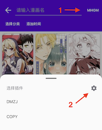
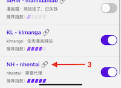
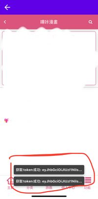

# MangaReader


一个漫画 APP📱，基于 react-native 构建，兼容 Android、Ios，尽可能适配平板

- 插件式设计
- 收藏、搜索、批量更新、下载、导出
- 图片手势控制、本地缓存
- 收藏备份和恢复

<p align="center">
  
</p>

## Plugins

- [x] ~~[manhuagui](https://www.mhgui.com/)（大陆版，访问 403，已失效）~~
- [x] [manhuaguimobile](https://m.manhuagui.com/)（需要代理）
- [x] [copymanga](https://www.copymanga.org/)
- [x] [manhuadb](https://www.manhuadb.com/)
- [x] [jmcomic](https://18comic.vip)（屏蔽日本 ip，目前主站到国内站点的自动跳转失效，需要代理）
- [x] [dongmanzhijia](https://m.dmzj.com/)
- [x] ~~[manhuamao](https://www.maofly.com/)（网站挂了，已失效）~~
- [x] [klmanga](https://klmanga.net/)
- [x] [nhentai](https://nhentai.net/)（需要代理，[获取 Cookies](#nhentai)）
- [x] [pica](https://manhuabika.com/)（需要代理，[获取 Token](#pica)）

## Installation

```bash
> git clone https://github.com/youniaogu/MangaReader.git
> cd MangaReader
> yarn install
> cd ios
> pod install
```

## Download

Android：[下载](https://github.com/youniaogu/MangaReader/releases)

Ios：[未签名 ipa](https://github.com/youniaogu/MangaReader/releases)

## NHentai

nhentai 开启了 cloudflare 的 ddos 保护，在使用此插件前，请遵循下面流程在 webview 里通过 cloudflare 校验并获得 cookies

webview 存在 bug，需要安卓版本 9 及以上

<div>
  
  
  
</div>

## Pica

pica 在登录并获取 token 后才能访问漫画，所以需要在 webview 里登录 pica 账户

<div>
  
  
</div>

## About

很喜欢看漫画，能在一个 APP 里看完所有的漫画，是我一直以来的想法

这个项目是在工作之余开发的，时间有限，如果遇到问题，欢迎 Issues

最后感谢 Star，你的 Star 是我更新的动力

## License

[MIT](https://github.com/youniaogu/MangaReader/blob/master/LICENSE)
